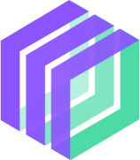

# StreamJam



StreamJam is a structured and slightly opinionated framework that brings websocket-based 
Remote Procedure Call (RPC) architecture to web development. It enables you to create full-stack 
stateful components that seamlessly bridge the gap between the frontend and backend, allowing you 
to develop modern, highly interactive and realtime web applications.

## Features

- **Full-stack Components**: Build components that combine server-side logic with client-side UI, providing a unified development experience.
- **Real-time Updates**: Create real-time, collaborative applications with seamless communication and state updates across multiple clients.
- **Websocket-based RPC and Streaming**: Leverage the power of RPC over WebSockets to facilitate direct method invocation, bringing your web development experience closer to real programming. The REST can rest in peace.
- **Automatic State Synchronization**: Enjoy automatic state synchronization between the server and client, eliminating the need for explicit data-binding or state management code.
- **Organically Scalable**: (WIP)

---
```python
from streamjam import Component

class Counter(Component):                       #  StreamJam Component definition.
    count: int = 0                              #  Component state declaration.

    class UI:                                   #  Client side SvelteJS code embedded within Python.
        """@                                    #  @ marks this docstring as Svelte code.
        <div>Count: {count}</div>               // Component state is available to use here directly.
        <button on:click={inc}>Add 1</button>   // Call methods defined as RPC for event handling and more.
        """

    @Component.rpc
    async def inc(self):
        self.count += 1                         # Assignments to component state are auto-synced with the client.
```
---

## Setup for Developers

### Setting up library
- Clone Streamjam from Github
- `pip install -e .`
- cd to `javascript/streamjam`
- `npm i`
- `npm link`

### StreamJam VSCode Plugin
StreamJam comes with a VSCode plugin that provides syntax highlighting and intellisense for
Svelte code that is embedded within a streamjam component's python file. This plugin depends 
on the official Svelte VSCode Extension, so please install that prior to installing the following.

- [Install Svelte Extension](https://marketplace.visualstudio.com/items?itemName=svelte.svelte-vscode)
- [Install StreamJam Tools](https://marketplace.visualstudio.com/items?itemName=Creativesands.streamjam-tools)

---

## Creating a New Project
- Run the following command to create a new StreamJam project:  
`streamjam create`
  - project_name: Simple StreamJam
  - project_slug: simple_streamjam
  - project_slug: Simple project to get started with StreamJam
- Open the project in VSCode.

Once the project is created, run each of the following commands in a new terminal:
1. **StreamJam Compiler**:    
   This command will watch for changes in your project and build the corresponding frontend files.
   - `cd simple_streamjam`
   - `streamjam build`
2. **StreamJam Frontend Setup**: 
   - `cd .build`
   - `npm i`
   - `npm link streamjam`
   - `npm run dev`
3. **StreamJam Server**:
   - `cd ../..` Parent of `simple_streamjam` directory.
   - `python -m simple_streamjam.main`
   - The server does not yet auto-reload on changes. Use `ctrl+c` to terminate and restart.

You're now ready to build some awesome stuff.

---

## StreamJam — A Crash Course

### Project Structure

The following is the file structure created by `streamjam create` when making a new project.

```text
project_home/
├── main.py
├── components/
│   └── root.py
├── public/
│   └── streamjam.svg
├── package.json
├── requirements.txt
│--------------------------
├── .build/
│   ├── index.html
│   ├── project.json
│   ├── src/
│   │   ├── App.svelte
│   │   ├── main.js
│   │   └── components/
│   │       └── Root.svelte
│   └── public/
│       └── streamjam.svg
```

The contents of `.build` are created by `streamjam build` command. Notice that python files in 
the components directory gets compiled to `.svelte` files if they contain a streamjam component 
class definition. 


### Creating a new StreamJam component

StreamJam components must be placed within the `components` directory. `root.py` defines the `Root` 
component of the application. Let's create a basic hello-world Root component.

```python
# root.py
from streamjam import Component

class Root(Component):
    name: str = 'World'

    class UI:
        """@
        <p>What is your name: <input type="text" bind:value={name} /></p>
        <h2>Hello {name}</h2>
        
        <style>
            h2 { color: #8BC34A; }
        </style>
        """
```

On save of root.py, `streamjam build` will compile this to `Root.svelte` file in the build directory.
Follow the url displayed by `npm run dev` to view the app in your browser. As you type text into the
input field, you should see it immediately being reflected in the greeting below.

> Note: restart the python server to run the updated code.

---

## StreamJam Concepts

The following are the main concepts of StreamJam:
- Component
  - UI
  - RPC Method
  - Event Dispatch
  - Event Handler
  - State Update Handler
  - Service Event Handler
- Service
  - PubSub
- StreamJam DevTools

---

## Component

Components are the building blocks of a StreamJam application. Each component
packs the frontend and backend together into single cohesive unit: 
- The UI (frontend) can call the methods defined in the component as though 
  they're locally defined methods.
- The state variables of the component are also kept in-sync between the two parts.
  Any assignments made to these variables within the backend section will automatically
  update the variable in the frontend; and further, if these variables are used in the 
  HTML template, then they'll automatically re-render to show the latest value. 
  State changes made in the frontend are synced with the backend as well. 

Components can be composed together to build higher level functionality. 

> Multiple instances of a component can be created, each will maintain its own state. 
> Further, all the components are themselves scoped to a user session. 

### Component UI

The client part of a component is written in Svelte JS. Defining an interface typically involves
describing the layout (HTML), styling it (CSS) and handling user interactions and events (JS). 
All of these can be written in the UI class definition using HTML tags, Style tag and Script tag respectively.    
